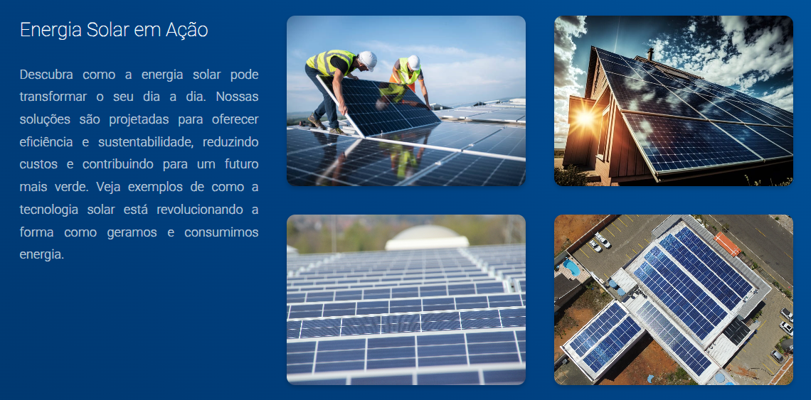

## Felipe Soluções Solares

Bem-vindo ao repositório do site da Philippe Santos Soluções Solares. Este projeto foi desenvolvido para apresentar e promover os serviços de uma empresa especializada em soluções de energia solar.

## Descrição do Projeto

O site da Philippe Santos Soluções Solares foi criado para fornecer informações detalhadas sobre as soluções oferecidas pela empresa, incluindo a instalação de painéis solares, benefícios da energia solar, e como a tecnologia pode transformar a geração e consumo de energia. O design é moderno, com foco em uma experiência de usuário agradável e informativa, e é totalmente responsivo para garantir uma visualização adequada em qualquer dispositivo.

## Tecnologias Utilizadas

HTML: Estrutura o conteúdo do site de forma semântica e acessível.
CSS: Estiliza o site para torná-lo visualmente atraente.
Sass: Utilizado para escrever CSS de forma mais eficiente e modular.
JavaScript: Adiciona interatividade ao site, melhorando a experiência do usuário.

## Sobre o Projeto

Este projeto foi desenvolvido para demonstrar a criação de um site que promove soluções de energia solar. Focado em destacar os benefícios da energia solar e facilitar o contato com a empresa, o site foi projetado com uma estética limpa e profissional, garantindo que a informação seja clara e acessível.

## Visite o Site
Confira o site através do link: https://zerezeze.github.io/felipe-solucoes-solares/

## Contato
Para mais informações sobre o projeto ou para discutir futuras colaborações, envie um e-mail para joseevertonmotarodrigues@gmail.com

Obrigado por visitar o repositório do site da Philippe Santos Soluções Solares!

